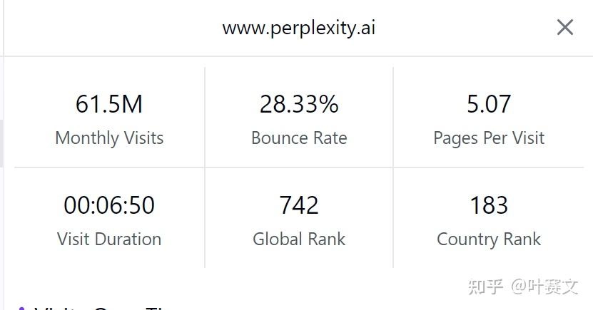
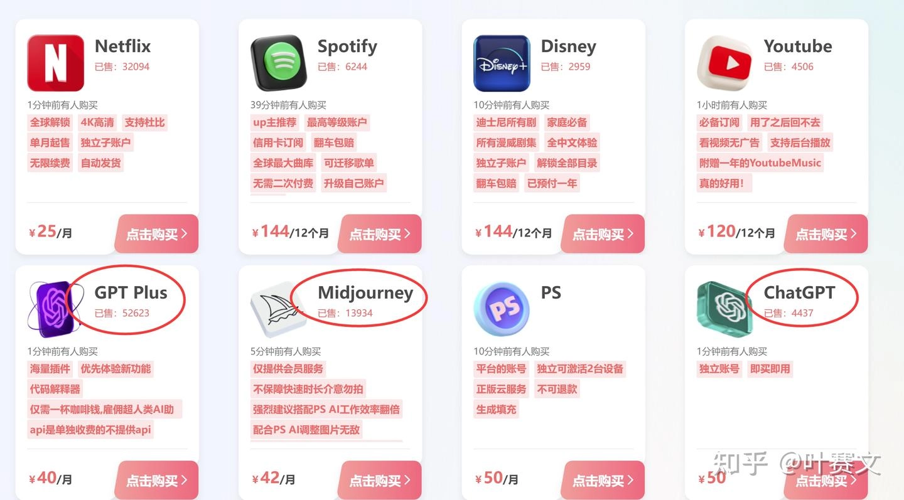

# AI搜索引擎Perplexity：为什么它比ChatGPT更适合做内容研究

---

最近翻译了一篇关于Perplexity AI的文章，突然意识到一件事：我们真的需要那么多搜索工具吗？

答案是——如果你经常做内容创作、课程制作，或者需要快速找到靠谱信息，Perplexity可能比你想象的更有用。它不是ChatGPT的替代品，而是解决了ChatGPT解决不好的问题。

先说结论：**Perplexity最大的优势是实时性和准确性**。它每个月有6100万访问量，不是没有原因的。

---

## Perplexity到底是什么

简单说，它是个会总结的搜索引擎。

你问它问题，它不会像Google那样甩给你一堆链接让你自己翻。它会：
- 直接给你答案
- 告诉你信息来源
- 用对话的方式和你聊

有点像微软的新Bing，但界面更干净，速度更快。

## 它为什么适合做内容研究

我自己试用后发现，Perplexity特别适合这几种场景：

**场景一：你要写教程或课程**

过去做教程要自己搜资料、验证信息、整理笔记。现在你直接问Perplexity，它帮你把最新的、靠谱的信息整理好。你只需要决定怎么组织内容。

**场景二：你需要快速验证事实**

ChatGPT有时候会"一本正经地胡说八道"。Perplexity不会。它每个答案都带着信息源链接，你可以直接点开验证。

**场景三：你想跟上最新动态**

ChatGPT的知识库有时间限制。Perplexity直接从网上抓取最新信息，包括学术数据库。你问2024年发生的事，它能给你答案。

## 为什么不用ChatGPT

这不是非此即彼的问题。

ChatGPT擅长的是创意、对话、改写。但如果你需要准确的、有来源的、最新的信息，Perplexity更可靠。

具体来说：

**实时性**
ChatGPT的知识库是固定的，更新周期长。Perplexity每次都从网上抓取最新内容。

**准确性**
ChatGPT有时候会编造信息（业内称为"幻觉"）。Perplexity因为必须提供信息源，这种情况少很多。

**可验证性**
ChatGPT给你答案，没有出处。Perplexity每个答案都带着引用链接。你可以点开看原文，确认它没有瞎说。

举个例子：
- 你问ChatGPT："2024年最受欢迎的编程语言是什么？"它会给你一个答案，但你不知道这个答案基于什么数据。
- 你问Perplexity同样的问题，它会告诉你答案，还会附上Stack Overflow、GitHub等网站的最新统计数据链接。

这对做内容的人来说很重要。你的教程、文章里的信息越准确、越有出处，读者越信任你。

## 实际使用流程

我现在做内容研究基本是这个流程：

1. **确定主题** - 想清楚要写什么，学习目标是什么
2. **用Perplexity做初步研究** - 问几个关键问题，收集信息和数据
3. **验证关键信息** - 点开那些信息源链接，确认数据准确
4. **组织内容** - 根据收集到的信息，写自己的内容
5. **保存引用** - 把重要的信息源保存下来，方便后续引用

整个过程比以前快很多。以前我可能要打开十几个网页，一个个看，一个个做笔记。现在Perplexity帮我完成了第一轮筛选。

如果你经常需要制作高质量教程、做付费课程，或者在社区里回答问题，👉 [使用Perplexity Pro能大幅提升研究效率，让你的内容更专业、更有说服力——这里有Perplexity Pro年费成品号，24H自动发货，365天质保](https://shaoyumi.com/buy/64)。专业版支持更多高级功能，包括更深入的学术搜索和更详细的引用。

## 一些使用技巧

用了一段时间，发现几个小技巧：

**技巧1：具体化你的问题**
不要问"AI是什么"，而是问"2024年企业最常用的AI工具有哪些"。越具体，答案越有用。

**技巧2：利用Copilot功能**
Perplexity有个交互式Copilot，可以帮你细化问题。如果第一次没问清楚，它会引导你问得更准确。

**技巧3：保存有用的对话**
你可以把研究过程保存下来，方便以后回顾。这比到处复制粘贴效率高多了。

## 它不完美

说实话，Perplexity也有局限性：

- 中文资源相对少一些，英文内容质量更高
- 免费版有查询次数限制
- 对于需要深度思考的任务（比如写代码、创意写作），还是ChatGPT更强

但如果你的主要需求是**快速找到准确信息**、**做内容研究**、**验证事实**，Perplexity真的很好用。

---

总结一下：Perplexity不是要替代ChatGPT，而是补充了它的短板。对于内容创作者来说，这两个工具配合使用效果最好——用Perplexity做研究和事实验证，用ChatGPT做创意和内容生成。

如果你经常需要制作教程、写技术文章，或者运营付费社区，👉 [试试Perplexity Pro，它能让你的内容研究效率翻倍——Perplexity Pro年费成品号这里直接购买，省去注册麻烦](https://shaoyumi.com/buy/64)。毕竟，信息准确性直接影响你的专业形象和用户转化率。
